# Multi-Blockchain Wallet in Python


## Universal Blockchain Wallet

A Blockchain wallet is a digital wallet that allows users to store and manage their crypto currencies. Each of the Crypto currencies have 
designed their own wallets the users can use to manage their keys and account balances. but having multiple wallets for each currency is not a practical approach. 

Thankfully, There's a command line tool, `hd-wallet-derive` that supports not only BIP32, BIP39, and BIP44, standards but also supports non-standard derivation paths for the most popular wallets out there today! However, we need to integrate the script into our blockchain with Python. Once we've integrated this "universal" wallet, we can begin to manage billions of addresses across 300+ coins.

In this project, however, we will try to create a wallet to get 2 coins working: Ethereum and Bitcoin Testnet.
Ethereum keys are the same format on any network, so the Ethereum keys should work with your custom networks or testnets. Hence we will use of local
testnet Ethereum network we developed using PoA consensus algorithm. ['PoA BlockChain'](https://github.com/pdevalaraju/POA_Development_Blockchain). 
This will demonstrate our wallets ability to not only intereact with publicly available testnet blockchains but be able to interact and make transactions within our local blockchain network using the same wallet. 

## Pre Requisites and Installations

The environment setup and pre requisite installation instructions Please refer to ['Requirements'](/Requirements.md) 

## Creating a Wallet

<details><summary> <b> Setup constants </b> </summary>


- A python file called constants.py` is created to set preset our wallet with predetermined coin types configue the crypto currencies we want to manage using our wallet. This file will be imported into our wallet.py to make the configured token/coin types accessible via our wallet program via referencing these strings, both in function calls, and in setting object keys.

  - `BTC = 'btc'`
  - `ETH = 'eth'`
  - `BTCTEST = 'btc-test'`

</details>

<details><summary> <b>Generating a Mnemonic </b> </summary>

- Generate a new 12 word mnemonic using `hd-wallet-derive` or by using [this tool](https://iancoleman.io/bip39/).

- Set this mnemonic as an environment variable, and save it in .ENV file which can be called via the wallet everytime you want to access the wallet keys: `mnemonic = os.getenv('MNEMONIC', 'insert mnemonic here')`

</details>

<details><summary> <b>Deriving the wallet keys </b> </summary>

- We will make use of the `subprocess` library to call the `./derive` script from Python. 

- The following flags are configured/passed into the shell command as variables:
  - Mnemonic (`--mnemonic`) must be set from an environment variable, or default to a test mnemonic
  - Coin (`--coin`)   - reads from the constants.py program we imported. 
  - Numderive (`--numderive`) to set number of child keys generated
  - cols - columns headers from the bip44 output
  - the ./derive script command will look like 

```shell
  'php derive -g --mnemonic= Mnemonic  --coin= Coin --numderive=Numderive  --cols= columns  --format=json'

  ```

- With the `--format=json` flag, we then parse the output into a JSON object using `json.loads(output)` and return the dictionary object of keys & addresses for each of the crypto currencies. The object is assigned to a dictionary variable called coins, when called will show the output as below.

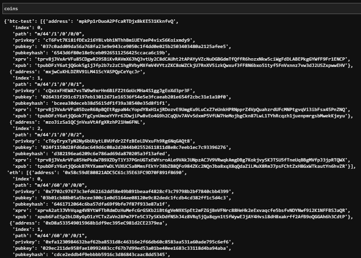

We can select child accounts (and thus, private keys) by calling `coins[COINTYPE][INDEX]['privkey']` where the token is either BTCTEST or ETH, index is the index # of the key for each token and the 'privkey' as the reference to the dictionary item. 

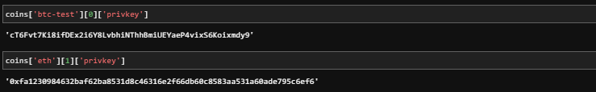

- All  the above is wrapped into one function, called `derive_wallets` which uses the parameters/flags configured above and fetches the keys from 
[this tool](https://iancoleman.io/bip39/) using your Mnemonic phrase. 


</details>

<details><summary> <b>Linking the transaction signing libraries</b> </summary>

Using `bit` and `web3.py` to leverage the keys we've got in the `coins` object using three core functions:

- Function `priv_key_to_account` -- this will convert the `privkey` string in a child key to an account object that `bit` or `web3.py` can use to transact. This function accepts the following parameters: 

  - `coin` -- the coin type (defined in `constants.py`).
  - `priv_key` -- the `privkey` string will be passed through here.

  Depending on the coin/token we seleccted, this function returns one of the following based on the library:

  - For `ETH`, returns `Account.privateKeyToAccount(priv_key)`
      - Account.privateKeyToAccount function is part of web3 librarary which returns an account object from the private key string. 	(https://web3js.readthedocs.io/en/v1.2.0/web3-eth-accounts.html#privatekeytoaccount).
  - For `BTCTEST`, return `PrivateKeyTestnet(priv_key)`
      - PrivateKeyTestnet is part of bit.py libarary that converts the private key string into a WIF (Wallet Import Format) object. WIF is a special 	format bitcoin uses to designate the types of keys it generates. [here](https://ofek.dev/bit/dev/api.html).

- Function `create_tx` -- this function will create the raw, unsigned transaction that contains all metadata needed to transact. The following parameters are to be passed to this function 
  - `coin` -- the coin type (defined in `constants.py`).
  - `account` -- the account object from `priv_key_to_account`.
  - `to` -- the recipient address.
  - `amount` -- the amount of the coin to send.

  Depending on the type of coin selected, this function returns one of the following functions based on the library:

  - For `ETH`, return an object containing `to`, `from`, `value`, `gas`, `gasPrice`, `nonce`, and `chainID`.
  - For `BTCTEST`, return `PrivateKeyTestnet.prepare_transaction(account.address, [(to, amount, BTC)])`

- Function `send_tx` -- this will call `create_tx`, sign the transaction, then send it to the designated network. This function accepts the following parameters:

  - `coin` -- the coin type (defined in `constants.py`).
  - `account` -- the account object from `priv_key_to_account`.
  - `to` -- the recipient address.
  - `amount` -- the amount of the coin to send.

  Depending on the type of coin selected, the function creates a `raw_tx` object by calling `create_tx` and then signs the raw transaction using 
  using `bit` or `web3.py' and broadcasts to the respective blockchain networks.

  - For `ETH`, return `w3.eth.sendRawTransaction(signed.rawTransaction)`
  - For `BTCTEST`, return `NetworkAPI.broadcast_tx_testnet(signed)`

Now, we should be able to fund these wallets using testnet faucets. 

</details>

<details><summary> <b>Bitcoin Testnet transaction </b> </summary>

- Fund a `BTCTEST` address using [this testnet faucet](https://testnet-faucet.mempool.co/).

- Use a [block explorer](https://tbtc.bitaps.com/) to watch transactions on the address.

- Send a transaction to another testnet address (either one of your own, or return back a part of the fund recieved to the sender).

- Below is the Screenshot of transaction confirmation:

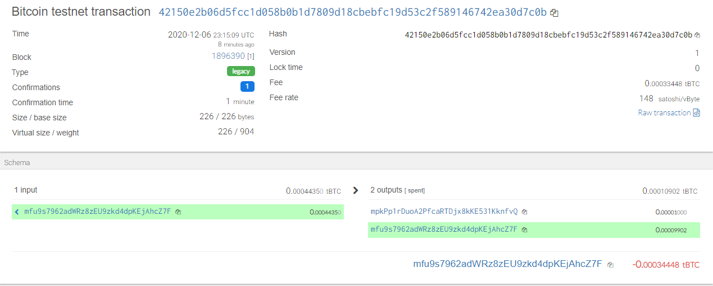

</details>

<details><summary> <b> 
Local PoA Ethereum transaction using </b> </summary>

- Please refer to the POA blockchain development [POA Testnet](https://github.com/pdevalaraju/POA_Development_Blockchain) 
- Add one of the `ETH` addresses to the pre-allocated accounts in your `poatestnet.json`.

- Initialize using `geth --datadir nodeX init poatestneet.json`. This will run our preconfigured local blockchain, and will pre-fund the new account.

- open myCrypto tool and connect to your local testnet node. If the local blockchain network is not running the transaction will fail. 

- Send a transaction from the pre-funded address within the wallet to another, then copy the `txid` into
  MyCrypto's TX Status. Below is the screenshot of successful transaction :

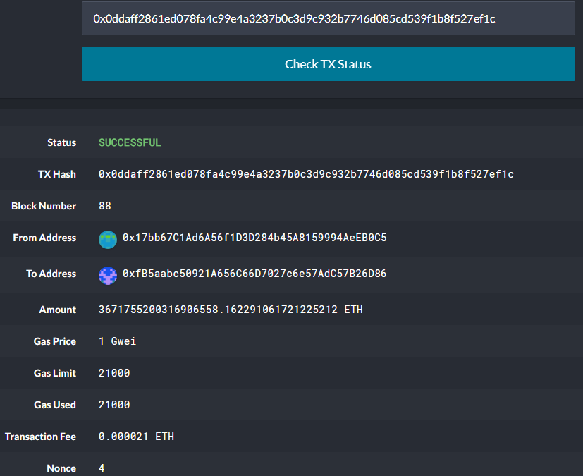

</details>

## Accessing the wallet functions from powershell or git bash

Open a new Anaconda powershell prompt and run python. at the next prompt, enter "from wallet.py import *" to be able to access the following wallet functions. 

<details><summary> <b>  get_priv_key(coin): </b> </summary>
	
- Desrciption: This fetches the private key from environment variable file depending on the cointype. 
	- This is alternate to fetching the keys from ['iancoleman.io'](https://iancoleman.io/bip39/) using the mnemonic phrase.
	- primarily for users who have created an environment variable file [.ENV] and stored all their keys in it.  
	- Key value pair in .env file should be of the format ETH_private_key if refererring ethereum and BTC_private_key for BTCTEST
	- params: cointype as string e.g 'ETH' or 'BTCTEST' 
	- output: returns private key string
	- note: This can be run as a stand alone function without any dependencies on other functions usage via terminal when you import this program under python command shell:

	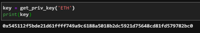

</details>

<details><summary> <b>  key_derive(mnemonic, cointype, numderive, cols) </b> </summary>
	
- Desrciption: function invokes hd-wallet-derive using [this tool](https://iancoleman.io/bip39/) to fetch the key pairs using BIP44 based on BIP39 tree of keys from the master key generated by bip32 mnemonic phase.

	- note: This can be run as a stand alone function without any dependencies on other functions
	- params: 

		- mnemonic phrase as string, cointype e.g: ETH or BTCTEST as string 
		- numderive - number of key pairs to derive as int
		- cols - columns of the bip44 output as string
		- cointype e.g 'ETH' or 'BTCTEST' as string or as list ['ETH', 'BTCTEST'] which gets translated into coin names in constants.py
		
		- out put can be accessed by calling coins['ETH'][INDEX]['privkey']
    	
	- output: returns dictionary object of addresses, private keys and othe rcolumns that are called in cols as string
        
	- output: 

	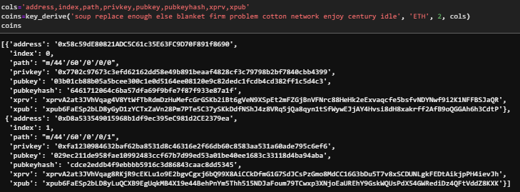

</details>

<details><summary> <b>   priv_key_to_account(priv_key, coin)  </b> </summary>
	
- Desrciption: fethces the account address using the private key using either bit or web3 libraries depending on cointype
	- This function can be run as a standalone function without dependencies on other functions
	- params: 'private key' and 'coin' (e.g: ETH, BTC) as string
   	- output: returns account object using Web3 or bit libraries.
	- Dependencies: send_tx function and create_tx functions require account object to be able to prepare & send transactions. Without calling this function by passing the private key and coin type, an Account object will not be created. 
	
	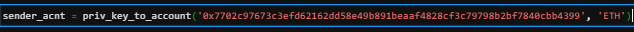
	- or 
	

</details>

<details><summary> <b>  create_tx(coin, account, to, amount): </b> </summary>
    
- Desrciption: creates crypto transaction by invoking bit or web3 libraries.

	- params: 
		- 'coin' - conitype as string, account - sender account object generated via priv_key_to_account function
		- 'to' - recipient's account object and 
		- amount to transact

	- output: returns raw transaction created by bit or web3 to the calling function - send_tx
  	- Dependencies: This function cannot be executed in isolation. send_tx function to be called by passing it's required parameters, which in 	turn triggers create_tx function. The output of create_tx function is returned to calling function send_tx which then gets the raw_tx signed and broadcasted before returning the transaction hash.

</details>

<details><summary> <b>  send_tx(coin, account, to, amount):  </b> </summary>

- Desrciption: this function invokes creating raw transaction and signs the transaction before broadcasting to the network

	- params: 
		- coin - cointype e.g 'eth' or 'BTCTEST' as string
		- senders account object generated via priv_key_to_account
		- recipients account Address as string and
		- amount to transact as string

	- output: returns the transaction hash.
	- dependencies: depends on the Account object generated via priv_key_to_account. You can pass this object via terminal command by capturing the output from the priv_key_to_account function and supplying it to this function as parameter. You can then print the transaction output by calling the variable that captures the funtion return.

	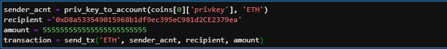

	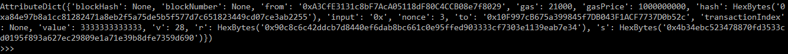
	

</details>

<details><summary> <b>  get_balance(sender, token): </b> </summary>

- Desrciption: This function requires the senders account object generated via priv_key_to_account function to check the account balance

	- params: accepts sender account as an object. run the priv_key_to_account(privkey, coin) function to get an account object

	- returns the account balance
	
	

	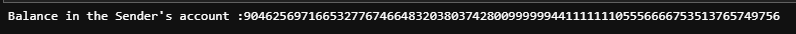

</details>

<details><summary> <b> get_transaction_status(txhash, token): </b> </summary>

- Desrciption: This is a standalone function to check the transaction status

	- params: accepts transaction hash and the coin type (ETH/BTCTEST) as strings
	- output returns the transaction status with blocknumber and Transaction ID once confirmed

	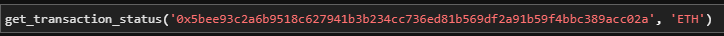
	
	- Transaction pending:
	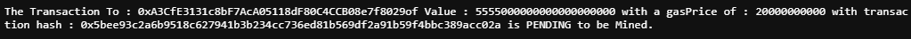

	
	
	- Transaction Successful:
	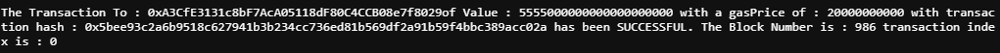

</details>

## Accessing the wallet functions using Jupyter Notebook

if you would like to play around with the functions or would like to add more, please use the [Notebook](/wallet.ipynb)
