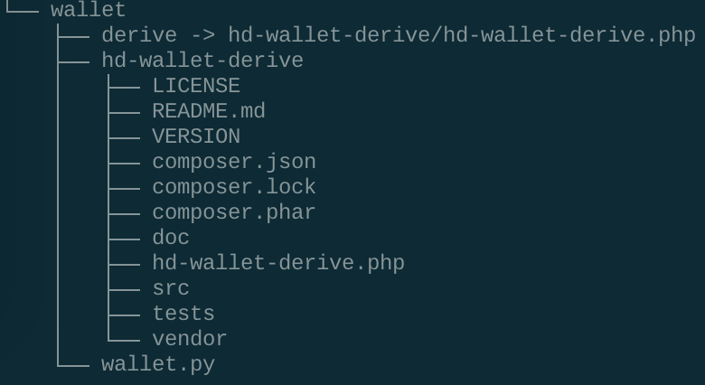

- Include installing pip dependencies using `requirements.txt`, as well as cloning and installing `hd-wallet-derive`.
  You may include the `hd-wallet-derive` folder in your repo, but still include the install instructions. You do not
  need to include Python or PHP installation instructions.

## Dependencies

- PHP must be installed on your operating system (any version, 5 or 7). 

- Clone the [`hd-wallet-derive`](https://github.com/dan-da/hd-wallet-derive) tool.

- intall [`bit`](https://ofek.github.io/bit/) Python Bitcoin library.

- install [`web3.py`](https://github.com/ethereum/web3.py) Python Ethereum library.

## Installation Instructions for hd-wallet-derive

- Create a project directory called `wallet` and `cd` into it.

- download [`hd-wallet-derive`](https://github.com/dan-da/hd-wallet-derive) tool and Clone the `hd-wallet-derive` tool into wallet folder and extract the contents of it into the same folder. 

- Create a symlink called `derive` for the `hd-wallet-derive/hd-wallet-derive.php` script into the top level project
  directory like so: `ln -s hd-wallet-derive/hd-wallet-derive.php derive`

- This will clean up the command needed to run the script in our code, as we can call `./derive`
  instead of `./hd-wallet-derive/hd-wallet-derive.php`.

- Test that you can run the `./derive` script properly, use one of the examples on the repo's `README.md`

The directory structure should look something like this:

